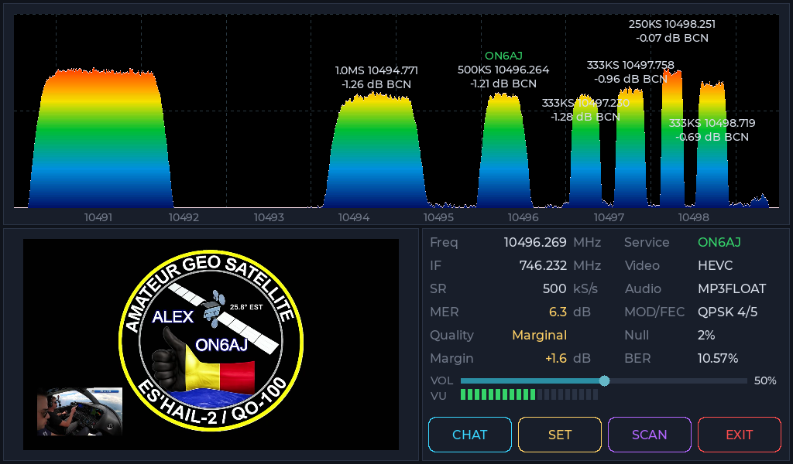
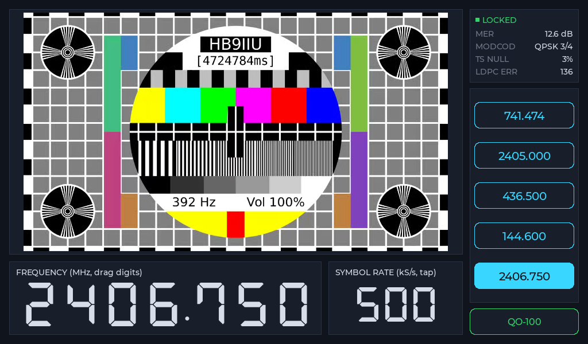

# QO-100 DATV Receiver (Raspberry Pi 4/5)

A standalone QO-100 (Es'hail-2) digital amateur TV receiver. Runs on a 
**Raspberry Pi 4 or 5**, driving a **MiniTiouner** tuner, with a fullscreen
touchscreen app that shows the spectrum, decodes the video, lets you tap to
tune, and connects to the QO-100 wideband chat. Everything is operated by
touch — no keyboard or mouse needed once it's set up.

<table>
<tr>
<td width="50%"></td>
<td width="50%" valign="top">
<a href="https://youtu.be/jz0K4KcEiIY">
<br>
▶ Tap to play video
</a>
</td>
</tr>
</table>

# 🆕 WHAT'S NEW!!!

## Manual Tune

A new **TUNE** page lets you dial in any frequency the MiniTiouner can
reach (144–2450 MHz) instead of only what happens to show up on the
spectrum — handy for checking a specific transponder, a local test
signal, or anything else off the beaten path.



- Tap **TUNE** on the main screen to open it — it starts you on Preset 1
  for a known-good, live signal.
- **Drag a digit up or down** to change it, like spinning the dial on a
  real frequency counter — no keyboard involved.
- **Tap the Symbol Rate** to cycle through the standard rates.
- **Presets** (the row of frequency buttons): tap one to load it
  instantly, or **press and hold** one to save whatever you're currently
  tuned to into that slot — a "SAVED ..." banner confirms it.
- **Tap the picture** to go fullscreen, tap it again to come back.
- Tap **QO-100** to leave the Tune page — this always retunes straight
  back to the beacon, so you can't wander off and lose track of where you
  left the dial.

## Local spectrum with an RTL-SDR (No internet needed — ideal for field operations)

The spectrum display can now be generated locally with an RTL-SDR instead
of using the remote BATC spectrum feed. At startup, the app detects compatible
Realtek RTL2832U sticks (`0bda:2838` or `0bda:2832`) and asks whether to use
the local receiver. This includes the usual USB identity used by RTL-SDR Blog
V3 and V4 sticks; unusually programmed or differently branded devices may
use another identity and are not detected yet.

Choose **YES** to start the bundled spectrum server. It scans the complete
QO-100 wideband transponder in overlapping sections and supplies the spectrum
directly to the touchscreen app. Choose **NO** to keep using BATC. If the
local server cannot start, the app reports the failure and returns to the
remote feed automatically. The RTL-SDR provides the spectrum only — the
MiniTiouner still receives and decodes DATV signals.

An RTL-SDR cannot power the satellite LNB. The local-spectrum connection
therefore needs an **external bias tee/power injector**, normally supplying
**18 V for the horizontally polarised QO-100 wideband transponder**. Use a
proper satellite bias tee that passes RF to the RTL-SDR while blocking its
DC supply from reaching the stick. If the LNB is already powered elsewhere
in the receive system, do not add a second power source.

The setup script installs the required USB permissions and reserves RTL2832U
devices for SDR use by blacklisting Linux's conflicting DVB-TV driver. This
means those sticks will no longer work as conventional Linux DVB-T tuners on
that Pi. A reboot at the end of setup applies the change.

**Existing installations:** rerun the full installer once to enable local
RTL-SDR support:

```bash
cd ~/DATVreceiver
scripts/initialSetup.sh
```

## What you need

- Raspberry Pi 4 Model B or Raspberry Pi 5, running Raspberry Pi OS
  (Bookworm or newer) with a desktop.
- A MiniTiouner tuner. Tested with the **Pro TS2** and the **S** — other
  variants (Express, original) likely work too but haven't been tried.
- Optionally, an RTL2832U RTL-SDR stick for a locally generated spectrum.
  Without one, the app continues to use the BATC spectrum feed. The RTL-SDR
  cannot power an LNB, so local reception also requires a suitable external
  bias tee/power injector (normally 18 V for the QO-100 wideband transponder)
  unless the LNB is already powered elsewhere.
- A touchscreen — either the official 800x480 Raspberry Pi touchscreen or
  a 1024x600 DSI panel (switchable any time from **SET** in the app).
- Something to play audio through. The Pi 5 has no 3.5mm audio jack (the
  Pi 4 does); either way, a DSI touchscreen has no speaker of its own, so
  there's no built-in audio output for a Pi 5 kiosk setup like this one —
  **a Bluetooth speaker is the easiest fix**, pair it once in Raspberry Pi
  OS's Bluetooth settings and it just works. A USB audio adapter or an
  HDMI-connected display with speakers works too, if you'd rather avoid
  Bluetooth.
- Internet access on the Pi — needed for setup and chat. It is also needed
  for the spectrum unless you select a local RTL-SDR at startup.

## Setup, step by step

Everything below is done by typing commands into a **terminal** — a
text-based command window. On the Raspberry Pi desktop, open one from the
taskbar (look for a black screen icon) or the applications menu, usually
under **Accessories > Terminal**. Each step below shows exactly what to
type; type or paste it in, then press **Enter** to run it.

### 1. Get the code and run the setup script

Paste this whole block in at once — it puts the project in a `DATVreceiver`
folder in your home folder, then runs its setup script.

```bash
cd ~
git clone https://github.com/HB9IIU/QO100-RASPI-RECEIVER.git DATVreceiver
cd ~/DATVreceiver
scripts/initialSetup.sh
```

The setup script does everything: installs all the software this app needs,
downloads one small third-party library it depends on, builds the app, sets
it up to start automatically at boot, and **reboots the Pi at the end** —
that last part matters because USB permissions and the RTL-SDR driver
blacklist take effect reliably after reboot. It will ask for your password
along the way, and asks for one Enter keypress up front to confirm before it
starts. Safe to
re-run (from `cd ~/DATVreceiver && scripts/initialSetup.sh`) if something
goes wrong partway through.

Plug the MiniTiouner and optional RTL-SDR into USB ports before or during
this step, if they are not already connected.

### 2. Check it worked

Once the Pi finishes rebooting and you're logged back in, the receiver
should appear on its own, fullscreen, tuned to the QO-100 beacon. If it
doesn't:

```bash
systemctl --user status qo100datv.service
```

This shows whether it's running, and if not, why. If it says "No
MiniTiouner detected on USB" on screen: check the tuner is properly plugged
in. If it doesn't lock onto a signal: make sure the antenna/LNB is actually
pointed at QO-100, and check the **SET** page for the LNB settings (LO
offset, bias voltage) match your hardware.

If an RTL-SDR is connected, the app asks whether to use it after startup.
If it reports that the local spectrum is unavailable, check
`qo100_sdl/rtl-sdr-server.log`. `LIBUSB_ERROR_BUSY` means the Linux DVB driver
or another SDR program owns the stick; rerun `scripts/initialSetup.sh` and
reboot. `LIBUSB_ERROR_ACCESS` means its USB permissions are missing; rerunning
the installer and rebooting fixes that as well.

## Updating

The app checks for updates on its own each time it starts, and offers to
install one right from the touchscreen if it finds one - no keyboard or
computer needed. This covers routine code updates (pulls the latest
version and rebuilds); it doesn't touch system packages, udev rules, or
reboot, so it never needs a password.

If an update ever needs more than that (a new dependency, a udev rule
change), do a full update by hand instead:

```bash
cd ~/DATVreceiver
scripts/initialSetup.sh
```

Same script as the initial install (now pulls the latest version itself
before rebuilding), safe to re-run any time.

## Using the app

- **Tap anywhere on the spectrum display** to tune to that signal.
- The small **L** or **R** marker on the spectrum identifies the selected
  source: local RTL-SDR or remote BATC.
- **CHAT** — opens the QO-100 wideband chat.
- **SET** — LNB settings (local oscillator offset, bias voltage), screen
  resolution, what **EXIT** does (see below), and whether the app auto
  starts at boot. The **SET** page's own **EXIT** button just closes
  the SET page and returns to the main screen — a different action from
  the main screen's **EXIT** button described next, despite sharing the
  name.
- **SCAN** — automatically hops between detected signals.
- **TUNE** — opens the Manual Tune page (see **What's NEW!!!** above) to
  dial in any frequency by hand.
- **EXIT** — closes the app; it restarts itself a few seconds later by
  default. **SET** has an Exit Button Behaviour option to change this to
  Full Stop instead, where EXIT closes it for good until you start it
  again yourself (from the desktop icon).

## Optional: photo album on your LAN

A small gallery you can browse from any device on your home network,
including a **Take Screenshot** button on the page itself (useful when the
app is fullscreen with no touch access — it captures whatever's currently
on screen, not just this app). To turn it on:

```bash
cd ~/DATVreceiver
scripts/setup_photo_album.sh
```

This prints a web address to open in a browser (e.g. `http://<pi's IP
address>:8090/`). Keeps the most recent 300 screenshots by default; delete
individual photos or select several for bulk delete right from the page.

## Uninstalling

```bash
cd ~/DATVreceiver
scripts/uninstall.sh
```

Undoes everything the setup steps above did — stops and removes both
background services, the desktop shortcut, MiniTiouner/RTL-SDR USB rules,
the RTL-SDR driver blacklist, and the UDP-buffer system tweak — then
**deletes the `DATVreceiver` folder itself**, screenshots and saved settings
included. No confirmation prompt;
back up anything you want to keep first. Installed software packages (apt)
are left alone — see the script's own comments for why.

## Repo layout

| Path | What it is |
|---|---|
| `longmynd_ws/` | The tuner driver (a modified version of an existing open-source project), talks to the MiniTiouner over USB. |
| `qo100_sdl/` | The actual app — the touchscreen UI you see and use. |
| `qo100_sdl/tools/rtl-sdr-server` | Bundled local RTL-SDR spectrum server. |
| `rtl-sdr-server-source/` | Source, tests, documentation, and build tooling for the bundled spectrum server. |
| `screenshots/` | Where the photo album keeps screenshots. |
| `scripts/` | The setup scripts described above. |

Default tuning at startup is the QO-100 beacon: 741474 kHz, 1500 ksps.

## License

[GPLv3](LICENSE), matching [Longmynd](https://github.com/BritishAmateurTelevisionClub/longmynd) (`longmynd_ws/`), the tuner driver this project is built on and vendors directly.

## Thanks

I put this together for fun, after finding a couple of unused Raspberry Pis
with displays sitting around and wanting to do something with them — I
didn't invent any of the real engineering here, I just assembled it. Real
thanks are owed to:

- **Heather Lomond**, who wrote [Longmynd](https://github.com/BritishAmateurTelevisionClub/longmynd), the actual driver talking to the MiniTiouner hardware and doing the real DVB-S/S2 work underneath this whole receiver.
- **Phil Crump**, whose fork of Longmynd adds the websocket status/control server this project builds on.
- **BATC** (British Amateur Television Club), whose live wideband spectrum feed and QO-100 chat this app connects to.
- **Andy Green**, author of libwebsockets, used throughout for all of the above.
- **Tom, ZR6TG**, whose OpenTuner interface was the spark that got me wanting to build this in the first place.
- **Steve, GH7VHG**, for testing the first release.
- **Claude**, who helped me build, debug, and optimize this — patiently, over a lot of iterations.

Feel free to use, copy, and modify any of this for your own QO-100 setup.
If you get stuck, open an issue and I'll try to help when I can, though I
can't promise a quick turnaround.
